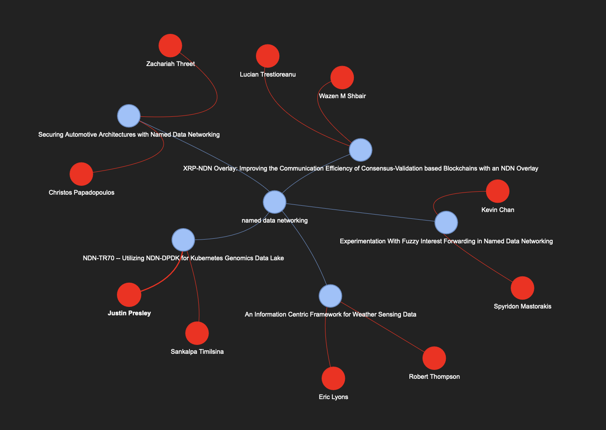
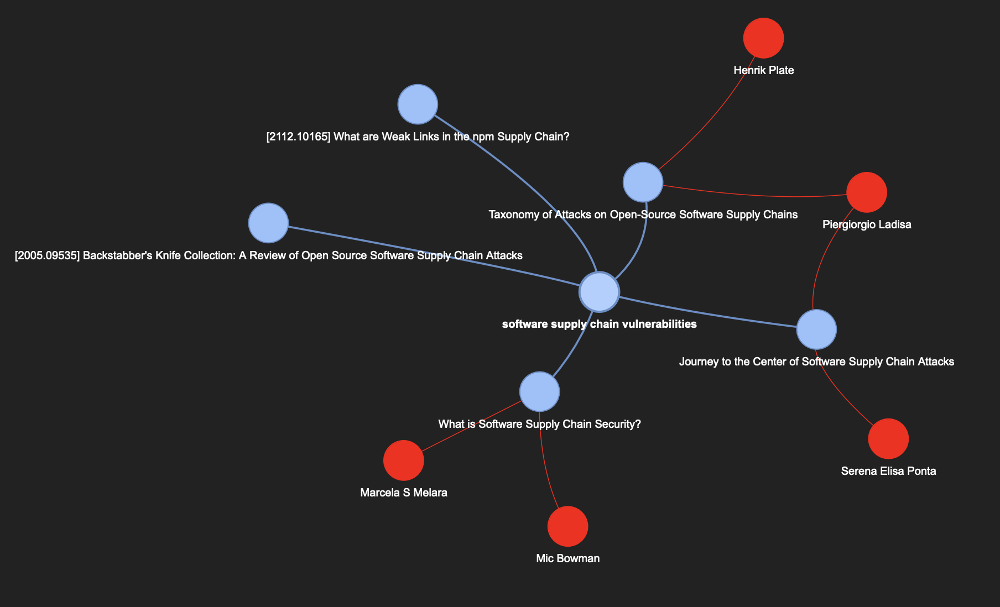
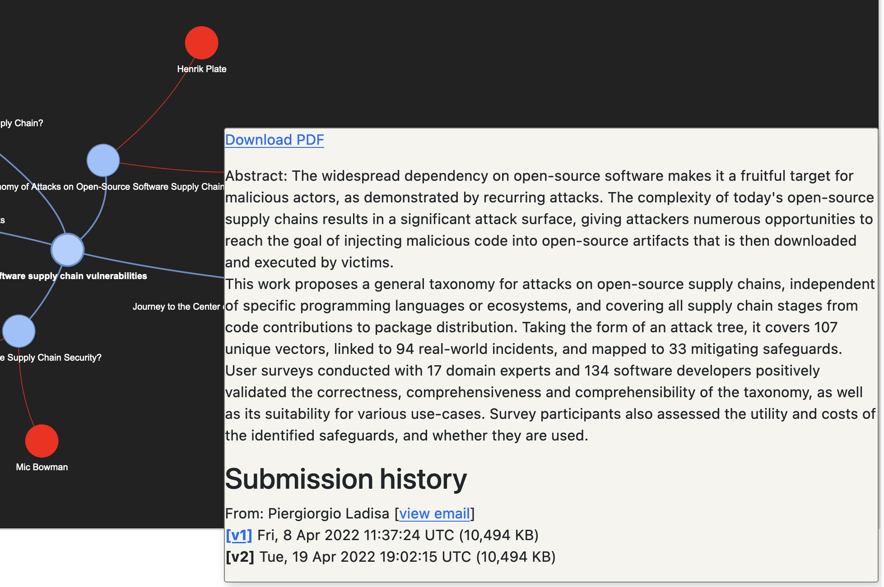

# Research Area Visualizer

This software provides a simple CLI tool that generates a graph visualization of
research papers and authors around a user-provided topic.

## Usage

Set up python environment with packages from `requirements.txt`.

To generate graph: `python src/main.py "<research area/prompt>"`

Generates `./output.html` by default, which can then be viewed in a browser.
Topic is shown in the middle, surrounded by relevant papers in blue. Authors are
shown in red.

## Results

### Named Data Networking Visualization

Visualization of the first topic I did research on in college. Fun to look back
on! Generated with `python src/main.py "named data networking" -n 5`.

### Software Supply Chain

Additional example. Authors that have written multiple papers within visualization are only displayed once, and connected to both papers.

### Detail View of Abstract

This view shows how a paper's abstract/background information from Arxiv can be viewed by hovering over its node.

## Future Work

Due to the limited time allowed for this project, I wasn't able to implement
some of the features I was excited about. Some of these additional features and
improvements include:

- LLM integration/smart summarization (ingest entire paper with LLM and generate
  summary to display in graph)
- Dynamic expansion of graph visualization (click on node, and perform a
  similarity search on paper to display more papers or summarizations of other
  relevant sites and information sources)
- Better visualization handling (graph nodes often need to be manually moved so entire visualization is clear)
- Generate embeddings from paper summaries and cluster/link papers more
  precisely (I haven't fully thought this through, but I think there are a lot
  of interesting things to be done along these lines)

## Known Issues
- Multiple versions of the same paper on Arxiv are not properly joined into one
  entity
- Parsing of abstract/summary page on Arxiv occasionally is not done correctly
